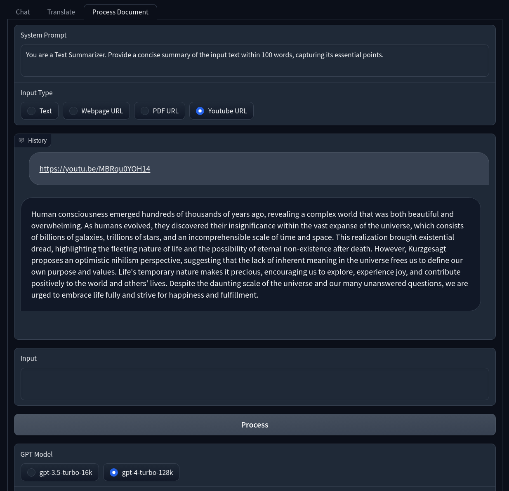

## HomeGPT
HomeGPT is a web application for seamless interaction with OpenAI's API, now boasting an expanded suite of features to enhance document processing capabilities. This intuitive platform is designed with a user-friendly Gradio interface and leverages LangChain's chat memory for optimally efficient performance.

From effortlessly improving your writing to summarizing complex texts, HomeGPT simplifies common language tasks with its array of predefined system prompts. Moreover, its capabilities extend into language translation, offering a dedicated interface that supports a wide range of languages, ensuring that communication barriers are easily overcome.

The latest update introduces a dedicated interface for comprehensive document handling. Whether it's plain text, HTML webpages, online PDF files, or even transcripts from Youtube videos, HomeGPT now empowers users to process various document formats with ease. 

With HomeGPT, experience the pinnacle of convenience and versatility in document processing and language translation, all within a single, streamlined application.

